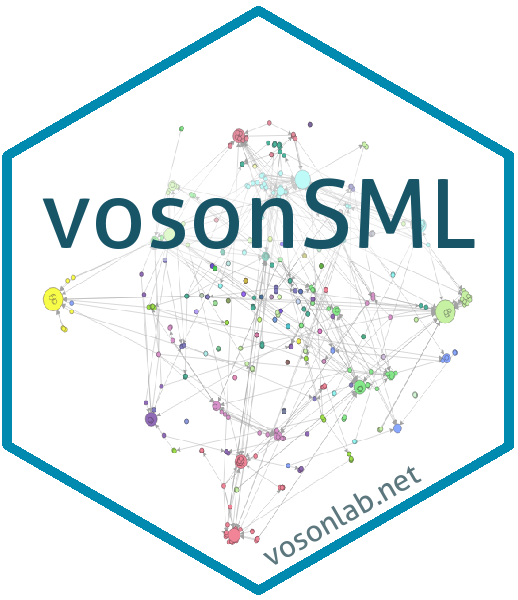

# vosonSML 


[](https://CRAN.R-project.org/package=vosonSML)


`vosonSML` is an R package that provides a suite of tools for collecting and constructing networks from social media data. It provides easy-to-use functions for collecting data across popular platforms and generating different types of networks for analysis.

`vosonSML` is the `SocialMediaLab` package, renamed. We decided that `SocialMediaLab` was a bit too generic and also we wanted to indicate the connection to the [Virtual Observatory for the Study of Online Networks Lab](http://vosonlab.net), where this package was conceived and created.

`vosonSML` was created by [Timothy Graham](http://uq.academia.edu/TimGraham) and [Robert Ackland](https://researchers.anu.edu.au/researchers/ackland-rj), with major contributions by [Chung-hong Chan](https://github.com/chainsawriot) and Bryan Gertzel.

### Supported Social Media

`vosonSML` currently features the collection of data and generation of networks from `twitter`, `youtube` and `reddit`. 

Unfortunately we are no longer able to maintain `facebook` and `instagram` collection, however these features will still be available in [releases](https://github.com/vosonlab/vosonSML/releases) prior to version `0.25.0`.

## Installation

Install the current version from Github:
```R
# requires the devtools package
devtools::install_github("vosonlab/vosonSML", subdir = "vosonSML")
```

Install vosonSML from CRAN:
```R
install.packages("vosonSML", dependencies = TRUE)
```

## Getting started

The [vosonSML page on the VOSON website](http://vosonlab.net/vosonSML) has several "how to" guides, including an "Absolute Beginners Guide to vosonSML" tutorial aimed at people with little or no programming experience.

### Usage

The process of authentication, data collection and creating social network in vosonSML is expressed with the three verb functions: *Authenticate*, *Collect* and *Create*. The following are some examples:

```R
library(magrittr)
library(vosonSML)

# Authenticate with youtube, Collect comment data from videos and then Create an actor network
actorNetwork <- Authenticate("youtube", apiKey = myYoutubeAPIKey) %>%
                Collect(videoIDs = myYoutubeVideoIds) %>%
                Create("actor", writeToFile = TRUE)

# Authenticate with twitter, Collect 100 tweets for the '#auspol' hashtag and Create a 
# semantic network
semanticNetwork <- Authenticate("twitter", appName = myTwitAppName,
                                apiKey = myTwitAPIKey, apiSecret = myTwitAPISecret,
                                accessToken = myTwitAccessToken,
                                accessTokenSecret = myTwitAccessTokenSecret) %>%
                   Collect(searchTerm = "#auspol", searchType = "recent", 
                           numTweets = 100, includeRetweets = FALSE, retryOnRateLimit = TRUE) %>%
                   Create("semantic", writeToFile = TRUE)

# Collect reddit threads and Create an actor network with comment text as edge attribute
actorCommentsNetwork <- Authenticate("reddit") %>%
                        Collect(threadUrls = myThreadUrls, waitTime = 5) %>%
                        Create("actor", includeTextData = TRUE, writeToFile = TRUE)
```
For more detailed information and examples, please refer to the [vosonSML documentation](https://github.com/vosonlab/vosonSML/blob/master/vosonSML.pdf).

## Special thanks

This package would not be possible without key packages by other authors in the R community, particularly: [igraph](https://github.com/igraph/rigraph), [rtweet](https://github.com/mkearney/rtweet), [RedditExtractoR](https://github.com/ivan-rivera/RedditExtractoR), [data.table](https://github.com/Rdatatable/data.table), [tm](https://cran.r-project.org/web/packages/tm/index.html), [magrittr](https://cran.r-project.org/web/packages/magrittr/), [httr](https://github.com/hadley/httr) and [dplyr](https://github.com/hadley/dplyr).
